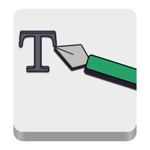
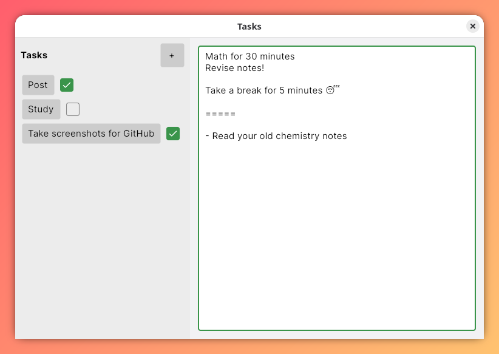

<p align="center">
	
</p>

# Tasks
A minimal desktop to-do app built with Avalonia, designed for instant use with automatic saving and simple local storage.

<p align="center">
	
	
</p>

## Features
- Automatic persistence (autosave)
- JSON-based local storage
- Reactive UI with data binding
- Cross-platform (Linux, macOS, Windows)

## Run
Go to [here](https://github.com/terra2o/Tasks/releases/) and download the latest release for your OS.

## Building
### Prerequisites
- .NET 9.0
- git

### Linux
```bash
git clone https://github.com/terra2o/Tasks.git
cd Tasks
chmod +x build-linux.sh
./build-linux.sh
```
Flatpak:
```bash
chmod +x build-flatpak.sh
./build-flatpak.sh
```

### Windows
```
git clone https://github.com/terra2o/Tasks.git
cd Tasks
dotnet publish -c Release -r win-x64 --self-contained true
```
### macOS (Silicon)
```bash
git clone https://github.com/terra2o/Tasks.git
cd Tasks
dotnet publish -c Release -r osx-arm64 --self-contained true
```

### macOS (Intel)
```
git clone https://github.com/terra2o/Tasks.git
cd Tasks
dotnet publish -c Release -r osx-x64 --self-contained true
```

## Data storage
Tasks are stored locally as JSON:

- Linux: `~/.config/Tasks_terra2o/tasks.json`
- Windows: `%APPDATA%\Tasks_terra2o\tasks.json`
- macOS: `~/Library/Application Support/Tasks_terra2o/tasks.json`

## Why this exists

I wanted a fast, distraction-free way to track small tasks without accounts,
sync, or heavy UI, and many more features than I need.

Most to-do apps felt over-engineered for something I just wanted to open,
edit, and close.

